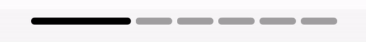

# UIKit Utils

## Содержание

- [BlurBuilder](#blurbuilder) - упрощение работы с blur-эффектом
- [ItemsScrollManager](#itemsscrollmanager) - менеджер для поэлементного скролла карусели
- [KeyboardPresentable](#keyboardpresentable) - семейство протоколов для упрощения работы с клавиатурой и сокращения количества одинакового кода
- [SkeletonView](#skeletonview) - cпециальная кастомная View для создания skeleton loader'ов
- [XibView](#xibview) - для работы UIView + xib
- [UIImageExtensions](#uiimageextensions) - набор часто используемых extensions для UIImage
- [CommonButton](#commonbutton) - Базовый класс для кнопки
- [UIDevice](#uidevice) – набор вспомогательных методов для определения типа девайса 
- [LayoutHelper](#layouthelper) – вспомогательный класс, для верстки под разные девайсы из IB
- [UIStyle](#uistyle) – класс для удобной работы с разными стилями UIView наследников
- [LoadingView](#loadingview) - набор классов и протоколов для удобного отображения загрузочных состояний с шиммерами
- [BeanPageControl](#beanPageControl) – page control с перетекающими индикаторами-бобами
- [TouchableControl](#touchablecontrol) – аналог кнопки с кастомизированным анимированием
- [CustomSwitch](#customswitch) – более гибкая реализация Switch ui элемента

### BlurBuilder

Утилита для упрощения добавления стандартного блюра на какое-либо View, позволяет управлять стилем и цветом блюра.

Пример:
```Swift
bluredView.addBlur(color: UIColor.white.withAlphaComponent(0.1), style: .light)
```

### ItemsScrollManager

Утилита для так называемого "порционного скролла".
Очень часто в проекте необходимо реализовать так называемую "карусель", где представлены некоторые элементы, просматривать которые можно посредством горизонтального скролла. При этом очень часто требуется, чтобы после скролла такой карусели она автоматически подскралливалась к какому-либо элементу, а не застывала на полпути, обрезая элементы в карусели.
Данная утилита предназначена для того, чтобы в левой части экрана всегда находилось начало какого-либо элемента.

Пример:
```Swift
// Создаем менеджер, указывая ширину ячейки карусели, расстояние между ячейками, а также отступы для секции UICollectionView с каруселью
scrollManager = ItemsScrollManager(cellWidth: 200,
                                   cellOffset: 10,
                                   insets: UIEdgeInsets(top: 0, left: 16, bottom: 0, right: 16))

// При этом необходимо помнить о том, что отступы для секции UICollectionView необходимо установить самому, к примеру:
let flowLayout = UICollectionViewFlowLayout()
flowLayout.scrollDirection = .horizontal
flowLayout.sectionInset = UIEdgeInsets(top: 0, left: 16, bottom: 0, right: 16))
collectionView.setCollectionViewLayout(flowLayout, animated: false)

// После чего необходимо добавить вызовы следующих методов в методы UIScrollViewDelegate
extension ViewController: UIScrollViewDelegate {

    func scrollViewWillEndDragging(_ scrollView: UIScrollView, withVelocity velocity: CGPoint, targetContentOffset: UnsafeMutablePointer<CGPoint>) {
        scrollManager?.setTargetContentOffset(targetContentOffset, for: scrollView)
    }

    func scrollViewWillBeginDragging(_ scrollView: UIScrollView) {
        scrollManager?.setBeginDraggingOffset(scrollView.contentOffset.x)
    }

}
```

### KeyboardPresentable

Семейство протоколов, цель которых - сократить кол-во одинаковых действий при работе с клавиатурой. В ходе данных работ выполняется, как правило, ряд действий, код которых идентичен в большинстве случаев - подписка на нотификации, отписывание от них, извлечение параметров из нотификации, таких как высота клавиатуры или время анимации. Данное семейство взаимосвязанных протоколов написано с целью сокращения количества одинакового кода.
Основной протокол - KeyboardObservable. Его вполне достаточно для работы, так как он позволяет инкапсулировать логику по подписыванию/отписыванию от нотификации, а при переопределении оставшихся двух методов - получить объект Notification из нотификации в чистом виде.
Для более простого извлечения параметров из нотификации создано еще два протокола:
- CommonKeyboardPresentable: позволяет получить информацию о высоте клавиатуры и времени анимации. При этом его методы не будут вызваны, если не удастся извлечь из нотификации высоту клавиатуры, а при невозможности извлечения времени анимации - будет использовано дефолтное значение.
- FullKeyboardPresentable: позволяет получить полную информацию о параметрах клавиатуры в виде структуры KeyboardInfo:
```Swift
public struct KeyboardInfo {
    var frameBegin: CGRect?
    var animationCurve: UInt?
    var animationDuration: Double?
    var frameEnd: CGRect?
}
```

Пример:
```Swift
// Рассмотрим необходимые действия для применения на примере CommonKeyboardPresentable
// Во-первых, необходимо объявить, что используемый ViewController реализует протокол KeyboardObservable
final class ViewController: UIViewController, KeyboardObservable {
    ...
}

// Для подписки на нотификации появления/сокрытия клавиатуры необходимо вызывать:
subscribeOnKeyboardNotifications()

// Для отписывания от нотификаций появления/сокрытия клавиатуры необходимо вызывать:
unsubscribeFromKeyboardNotifications()

// Во-вторых, необходимо объявить, что используемый ViewController реализует протокол CommonKeyboardPresentable
// В результате появления/сокрытия клавиатуры будут вызываться методы этого протокола, в которые приходят такие параметры, как высота клавиатуры и время анимации
extension ViewController: CommonKeyboardPresentable {

    func keyboardWillBeShown(keyboardHeight: CGFloat, duration: TimeInterval) {
        // do something useful
    }

    func keyboardWillBeHidden(duration: TimeInterval) {
        // do something useful
    }

}
```

### SkeletonView

Специальная кастомная View для создания skeleton loader'ов.
Вместе с самой view поставляются enum'ы для ее конфигурации и extension на UIView для создания масок.
Сценарий работы с SkeletonView:
1. Добавляем в нужное нам место view типа SkeletonView
2. Добавляем внутрь SkeletonView вьюхи, которые хотим использовать для анимации загрузки
3. Во ViewController'e кастомизируем SkeletonView(возможности по кастомизации ниже) и запускаем анимацию,
установив .shimmering = true

Возможности кастомизации:
```Swift
// Устанавливаем какие view(разрешены только subview данного skeletonView) должны участвовать в анимации(по умолчанию все subviews)
skeletonView.maskingViews = [view1, view2]

// Направление в котором бегает шиммер(по умолчанию - вправо)
skeletonView.direction = .left

// Цвет, которым закрашиваются эти самые maskingViews
skeletonView.gradientBackgroundColor = UIColor.red

// Цвет бегающего по ним шиммера
skeletonView.gradientMovingColor = UIColor.green

// Отношение ширины шиммера к ширине view. Допустимы значения в диапазоне [0.0, 1.0]
skeletonView.shimmerRatio = 0.7

// Длительность одного пробега шиммера в секундах
skeletonView.movingAnimationDuration = 1.0

// Длительность задержки между шагами анимации в секундах
skeletonView.delayBetweenAnimationLoops = 1.0
```
<details><summary>Примеры</summary>


</details>

### XibView

Утилита для использования .xib + UIView. Работает в коде через конструктор и в сторибордах.
Алгоритм:
1. Необходимо создать файлы – View.swift и View.xib.
2. У View.xib указать View.swift у FileOwner
3. Во View.swift в конструкторе вызвать метод xibSetup.

Пример:
```Swift
override init(frame: CGRect) {
    super.init(frame: frame)
    xibSetup()
}

required init?(coder aDecoder: NSCoder) {
    super.init(coder: aDecoder)
    xibSetup()
}
```

### UIImageExtensions

Набор часто используемых extensions для работы с UIImage

* Инициализатор позволяющий создать картинку с заданным цветом и размером 

  ```swift
  convenience init?(color: UIColor?, size: CGSize = CGSize(width: 1, height: 1))
  ```

* Метод **mask** – позволяет сделать картинку с заданным цветом или изменить параметры альфы у цвета картинки 

  ```swift
  func mask(with color: UIColor) -> UIImage 
  func mask(with alpha: CGFloat) -> UIImage
  ```
  * Метод **drawInitials** – Рисует инициалы на картинке с заданным шрифтом и цветом текста
  
  
  
  
  ```swift
  func drawInitials(firstname: String,
                    lastname: String,
                    font: UIFont,
                    textColor: UIColor) -> UIImage?
  ```
   * Метод **badgedImage** – Рисует бейдж на картинке 
   
   
   
   ```swift
   func badgedImage(count: Int, dimension: CGFloat, strokeWidth: CGFloat, backgroundBadgeColor: UIColor) -> UIImage? 
   ``` 
   Рисует бейдж в правом верхнем углу с цифрой, используется, например, для непрочитанных уведомлений, можно конфигурировать размер бейджа, его фон и ширину прозрачной линии между картинкой и бейджом
    ```swift
   func badgedImage(_ badgeImage: UIImage, dimension: CGFloat) -> UIImage?
    ``` 
    Рисует бейдж с заданной картинкой в правом нижнем углу, можно конфигурировать размер бейджа
  

### CommonButton

Базовый класс для UIButton. Упрощает работу с доступными у класса UIButton параметрами. 

Базовые возможности: 

* Устанавливать бекграунд у кнопки для массива состояний
* Устанавливать цвет тайтла кнопки для массива состояний
* Устанавливать значения для border у кнопки
* Изменять cornerRadius
* Увеличивать область нажатия у кнопки
* Устанавливать значение тайтла для всех состояний сразу
* Устанавливать значение картинки кнопки для всех состояний сразу

<details><summary>Примеры</summary>


</details>

### UIDevice

Набор вычисляемых проперти для определения размера экрана телефона. Данный набор утилит основывается на библиотеке [Device](https://github.com/Ekhoo/Device). Как и любая другая библиотека определяющая текущий телефон она требует поддержки в случае выхода новых, но эта библиотека была заброшена автором, поэтому мы добавили ее локально в папку UIDevice/Support и поддерживаем сами.

**Доступные методы:** 

`isSmallPhone` – возвращает `true`, если это телефон с размером экрана 5, 5c, 5s, SE

`isXPhone` – возвращает `true`, если это телефон версии X. Т.е. с челкой, большой safeArea и т.д.

`isNormalPhone` – возвращает `true`, если это телефон версии 6/7/8 или  '+'

`isPad` – возвращает `true`, если это iPad любой модели.

**Использование:**

```swift
guard UIDevice.isSmallPhone else {
    return
}
```

### LayoutHelper

Простой класс упрощающий верстку сложных экранов для разных типов девайсов. Например, если нам необходимо сделать разных отступ от верха экрана для разных типов устройств (X, 5s и обычный  7+), то нам придется притянуть аутлет с констрейнтом в код и прописать ему логику. С классом LayoutHelper теперь этого делать не надо. 

**Использование**

1. Унаследовать констрейнт в InterfaceBuilder от класса LayoutHelper.
2. На вкладке Attributes Inspector появится 3 вычисляемых проперти, которые можно задать для каждого типа экрана.
3. Типы экрана аналогичны методам из extension для UIDevice

### UIStyle

Класс и набор протоколов позволяющие удобно работать со стилями в приложение. 

`UIStyleProtocol` – протокол предоставляющий интерфейс любому наследнику UIView, к которому можно применить метод `apply`

`UIStyle` – джинерик класс отвечающий за настройку стиля для выбранного наследника UIView. 

`AttributableStyle` – вспомогательный протокол, который необходимо применять на класс UIStyle для того, чтобы была возможность вернуть массив атрибутов текущего стиля. 

**Использование**

```swift
/// Какой-либо класс наследник от UIView
class SomeView: UIView {}

/// Расширение, которое применяет стиль к своему инстенсу класса
extension SomeView {
    func apply(style: UIStyle<SomeView>) {
        style.apply(for: self)
    }
}

/// Класс стиля, который может содежрать в себе различные настройки и способы инициализации
final class SomeViewStyle: UIStyle<SomeView> {
    override func apply(for view: SomeView) {
        view.backgroundColor = .black
    }
}

/// Расширение на класс UIStyle, которое возвращает инстенс стиля
extension UIStyle {
    static var styleForSomeView: UIStyle<SomeView> {
        return SomeViewStyle()
    }
}

/// Применение
let someView = SomeView()
someView.apply(style: .styleForSomeView)

```

#### AnyStyle

В различных случаях может понадобиться возможность обернуть стиль в некий контейнер. Для этого есть класс AnyStyle. 

**Использование**: 

```swift
let anyStyle = AnyStyle(style: UIStyle.styleForSomeView)
anyStyle.apply(for: someView)
```
### LoadingView

Используется для упрощения работы с загрузочными состояними экрана на основе шиммеров. Позволяет формировать загрузочный экран из нескольких и даже разных блоков, блоком является кастомное View, выступающее в роли загрузочного элемента экрана, блоки можно дублировать сколько угодно раз, что может быть удобным для коллекций. 

`BaseLoadingView` - основная View, которая отвечает за отображение loading стейта, состоит из блоков и SkeletonView

`LoadingSubview` и `LoadingSubviewConfigurable` - протоколы, с помощью которых верстается LoadingSubview(блок)

`BaseLoadingViewBlock` - используется для инициализации и конфигурации LoadingSubview

`LoadingDataProvider` - протокол, формирующий блоки для loading стейта, применяется на UIViewController

**Использование**: 

Верстаем LoadingSubview, подписываем UIViewController под `LoadingDataProvider`, формируем блоки и инициализируем модель конфигурации `LoadingViewConfig`
```swift
extension viewController: LoadingDataProvider {
    func getBlocks() -> [LoadingViewBlock] {
        return [BaseLoadingViewBlock<CustomLoadingSubview>(model: .init()]
    }

    var config: LoadingViewConfig {
        return .init(placeholderColor: .gray)
    }
}
```
Инициализируем BaseLoadingView, передаем в метод configure наши блоки и конфиг, отображаем
```
let loadingView = BaseLoadingView(frame: view.bounds)
loadingView.configure(blocks: self.getBlocks(), config: self.config)
loadingView.setNeedAnimating(true)
loadingView.autoresizingMask = [.flexibleWidth, .flexibleHeight]

view.addSubview(loadingView)
view.stretch(loadingView)
view.bringSubviewToFront(loadingView)
```

### BeanPageControl

Page control с перетекающими индикаторами-бобами.




Набор кастомизируемых полей: 
- `count`
- `beanHeight`
- `inactiveBeanWidth`
- `activeBeanWidth`
- `padding`
- `beanCornerRadius`
- `beanActiveColor`
- `beanInactiveColor`

**Использование**

```swift
// Инициализация

let pageControl = BeanPageControl()
pageControlContainer.addSubview(pageControl)
pageControl.anchorCenter(to: pageControlContainer)
pageControl.activeBeanWidth = 100
pageControl.beanActiveColor = .yellow
self.pageControl = pageControl

// Обновление

adapter?.onChangePage = { [weak self] page, progress in
    self?.pageControl?.set(index: page, progress: progress)
}

```

### TouchableControl

Данный класс унаследован от стандартного UIControl. Позволяет принимать на вход различные UI элементы и, при нажатии на этот контрол,
анимировать их, иммтируя как бы нажатие на кнопку. То есть, по сути является аналагом кнопки с возможностью кастомизировать анимацию 
нажатия(затемнение или изменение цвета только некоторых элементов) 

**Доступные параметры:** 

`animatingViewsByAlpha` – сюда можно передать одну или несколько `UIView`, которые будут уменьшать `alpha` параметр, при
нажатии на контрол.

`onTouchUpInside`,  `onTouchCancel`, `onTouchDown` - блоки, для управления событий нажатия.

`touchAlphaValue` - параметр, типа `CGFloat`, определяющий на какое значени `alpha` будет изменяться элементы при нажатии

`normalDuration` - параметр, типа `TimeInterval`, определяющий в течение какого времени будет происходить затемнение

**Доступные методы:** 

`addChangeColor(to: UIView, normalColor: UIColor, touchedColor: UIColor)` - добавляет вью, у которой будет изменяться цвет при нажатии
на контрол

`clearControl()` - Для случаев, когда данный класс добавлен во вью, которая будет сама передана в него. 
Устонавливается в deinit ViewController'а с этой view

**Использование:**

```swift

class ViewController: UIViewController {

    @IBOutlet weak var someView: UIView!
    @IBOutlet weak var someLabel: UILabel!
    @IBOutlet weak var secondSomeLabel: UILabel!

    private let control = TouchableControl()

    override func viewDidLoad() {
        super.viewDidLoad()
        control.translatesAutoresizingMaskIntoConstraints = false
        someView.addSubview(control)
        NSLayoutConstraint.activate([
            control.topAnchor.constraint(equalTo: someView.topAnchor),
            control.leftAnchor.constraint(equalTo: someView.leftAnchor),
            control.rightAnchor.constraint(equalTo: someView.rightAnchor),
            control.bottomAnchor.constraint(equalTo: someView.bottomAnchor)
        ])

        control.animatingViewsByAlpha = [someLabel]
        control.addChangeColor(to: someView, normalColor: someView.backgroundColor, touchedColor: .blue)
        control.addChangeColor(to: secondSomeLabel, initColor: secondSomeLabel.textColor, goalColor: .orange)

        control.onTouchUpInside = {
        }
        control.onTouchCancel = {
        }
        control.onTouchDown = {
        }
    }

    deinit {
        control.clearControl()
    }
}

```

### CustomSwitch

Гибкая реализация ui элемента switch.
1) Умеет адаптироваться под разный размер.
2) Есть возможность задать закругления и отсутпы.
3) Есть возможность задать градиент вместо цвета.
4) Гибко настраивается анимация.
5) Есть возможность добавить тень для бегунка.

`CustomSwitch` – непосредственно сам элемент.

`CustomSwitch.LayoutConfiguration` - содержит padding(отступ от бегунка до краев), spacing(отступ от бегунка до сторон в обоих состояниях) и cornerRatio самого свитча.

`CustomSwitch.ThumbConfiguration` - содержит cornerRatio и shadowConfiguration(CSShadowConfiguration) для самого бегунка.

`CustomSwitch.ColorsConfiguration` - содержит в себе параметры для конигурации цвета подложки(on и off) и бегунка. Все три параметра имеют тип CSColorConfiguration. Это протокол с одним методом - `applyColor(for view: UIView)` и имеющий уже две реализации: `CSSimpleColorConfiguration` и `CSGradientColorConfiguration`.

`CustomSwitch.AnimationsConfiguration` - содержит параметры для конфигурации анимации свитча(duration, delay, usingSpringWithDamping, initialSpringVelocity, options).

Для обработки изменения стейта можно использовать стандартный event valueChanged.

**Использование**

```swift
let customSwitch = CustomSwitch(frame: CGRect(x: 0, y: 0, width: 100, height: 50))
customSwitch.layoutConfiguration = .init(padding: 1, spacing: 3, cornerRatio: 0.5)
customSwitch.colorsConfiguration = .init(offColorConfiguraion: CSSimpleColorConfiguration(color: .white),
                                         onColorConfiguraion: CSSimpleColorConfiguration(color: .green),
                                         thumbColorConfiguraion: CSGradientColorConfiguration(colors: [.lightGray, .yellow],
                                                                                              locations: [0, 1]))
customSwitch.thumbConfiguration = .init(cornerRatio: 0, shadowConfiguration: .init(color: .black, offset: CGSize(), radius: 5, oppacity: 0.1))
customSwitch.animationsConfiguration = .init(duration: 0.1, usingSpringWithDamping: 0.7)

customSwitch.setOn(true, animated: false)

// обработка

@IBAction func switchValueDidChange(_ sender: CustomSwitch) {
	print(sender.isOn)
}
```